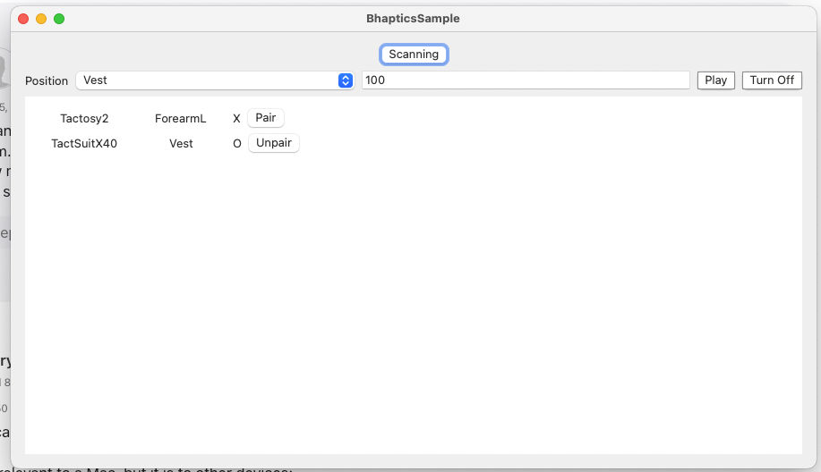

## 

### import
```
import BhapticsPlugin

var kit: BhapticsKit! = BhapticsKit()
 
```

### Scan/StopScn
```
let scanning = kit.isScanning()
if (scanning) {
  kit.stopScan()
} else {
  kit.scan()
}
```

### GetDevices and Pair/Unpair
```
let deviceList = kit.getDevices()

kit.pair(device: device)
kit.unpair(device: device)

```

## Example 
* Sample app is under SampleApp folder. Please check out the whole example.
