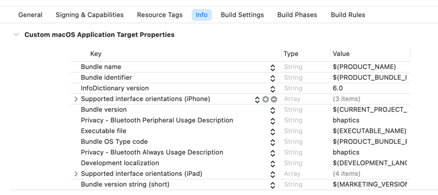
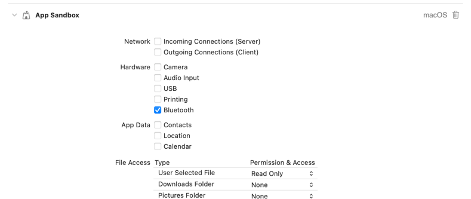

# bHaptics SDK for Apple devices

This SDK is under beta process so API might change rapidly without notifications.
We will soon add other features which are supported by other SDK(Unity/UE4)

tested under XCode 14.1, Swift 5.7 

## Features
* Pair/Unpair bHaptics devices
* Control vibration actuator with position and motor values.

## Installation
### Swift Package Manager
```
dependencies: [
    .package(url: "https://github.com/bhaptics/bhaptics-ios", .upToNextMajor(from: "0.1.0"))
]
```

* [How to add package dependencies to your app](https://developer.apple.com/documentation/xcode/adding-package-dependencies-to-your-app)

## Setup

### Add target property (Target > Info) (macOS/iOS)
These two keys are required if your app uses APIs that access Bluetooth peripherals.
bHaptics devices are also bluetooth devices and are required the same keys.


* [NSBluetoothAlwaysUsageDescription](https://developer.apple.com/documentation/bundleresources/information_property_list/nsbluetoothalwaysusagedescription)
* [NSBluetoothPeripheralUsageDescription](https://developer.apple.com/documentation/bundleresources/information_property_list/nsbluetoothperipheralusagedescription)




### macOS(Signing & Capabilities > App Sandbox )
* Check Bluetooth



## Documentation
* [How to use](Assets/HowToUse.md)

## Disclaimer
* This SDK is tested under the Mac computers with Apple silicon.